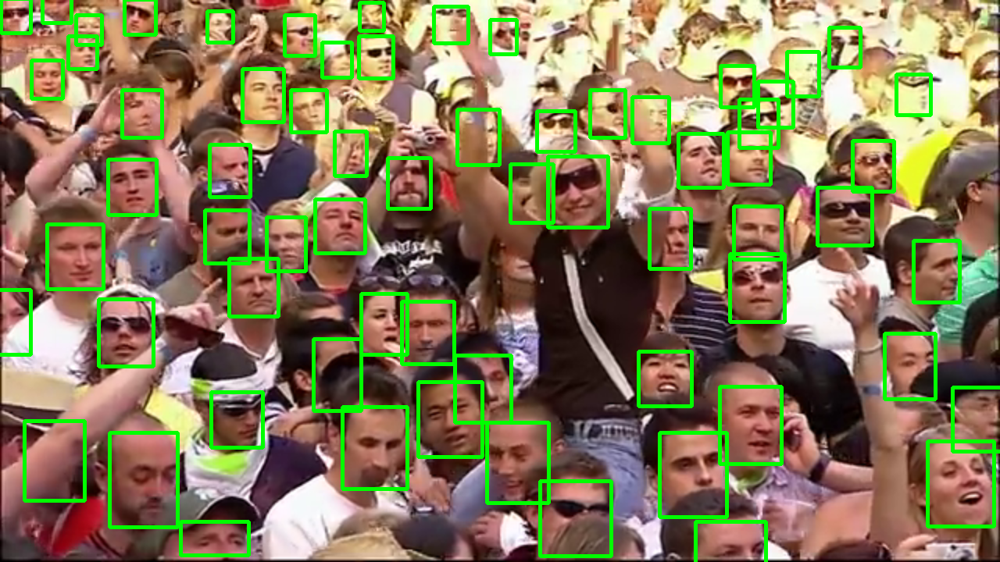

# SQLite ile Gerçek zamanlı yüz tanıma 

## -> Kullanılan Kütüphaneler:
| Kütüphane | Amacı |
|-----------|-------|
|colorama           | Renklendirilmiş kullanıcı bilgilendirmeleri için
|opencv-python      | Giriş verilerini işlemek için
|onnxruntime        | Yüz tanıma modeli için
|onnxruntime-gpu    | GPU kullanmak için
|insightface        | Yüz tanıma sistemi 1
|numpy              | Matematiksel işlemler için
|sqlite3            | SQLite iletişimi için
|argparse           | Kullanıcıdan dinamik girdiler almak için 
|numba              | Python'u hızlandırmak için


## Gereksinimlerin kurulması:
```shell
pip install -r requirements.txt
```

## Sisteme yeni bir kişi ekleme 
```shell
python3 main.py --add-face test/Robert\ Trujillo.png --name "Robert Trujillo"
```

# Video Veya Kamera üzerinden yayın takibi
```shell
# Video üzerinden
python3 main.py --cam test/test_video.mp4 --res 1280,720


# Dahili webcam üzerinden
python3 main.py --cam 0 --res 1280,720
```


# Görüntüler:




